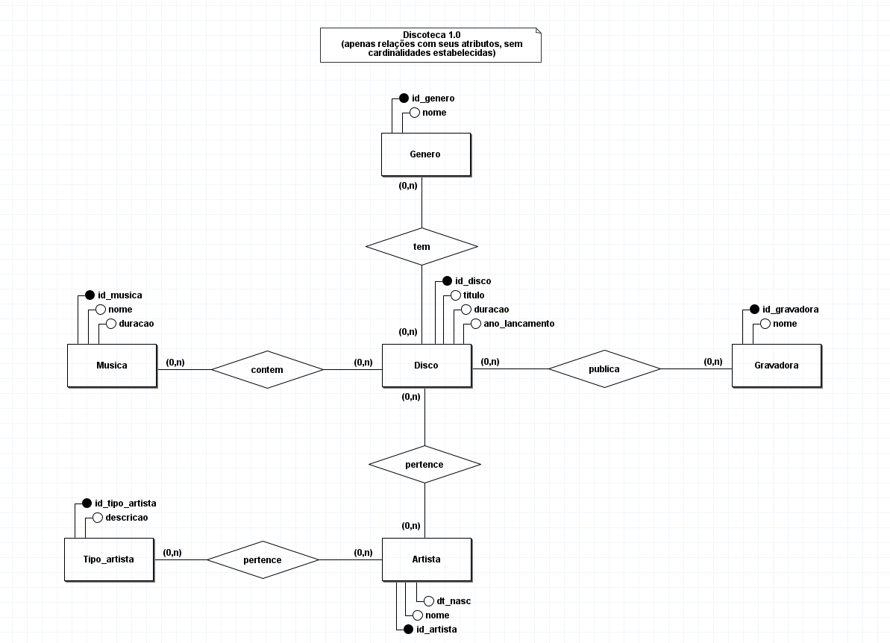
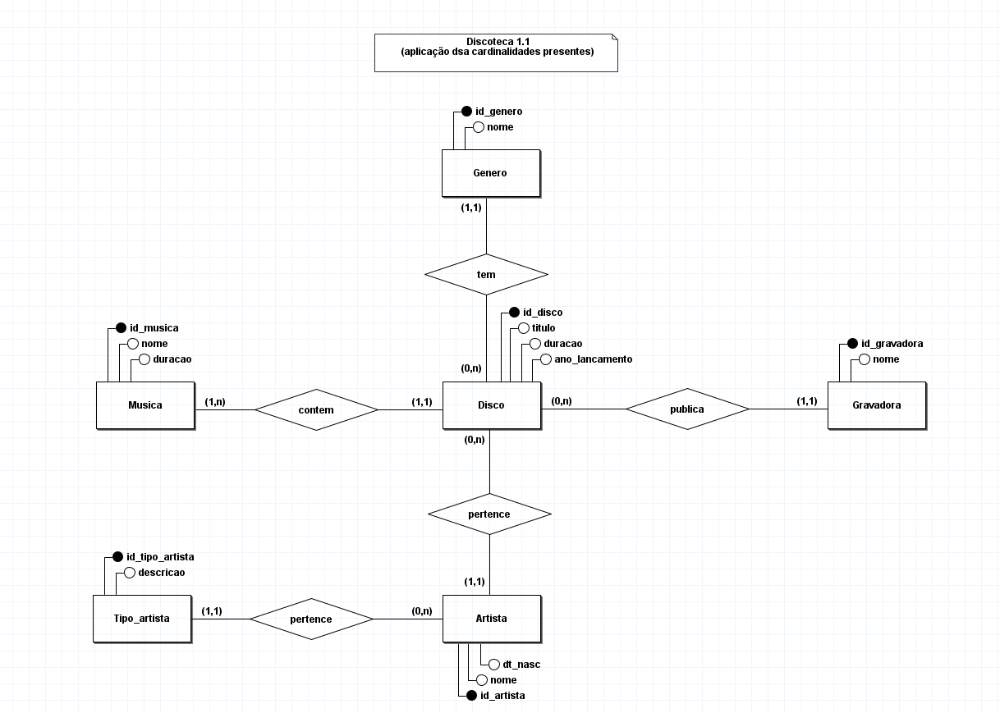
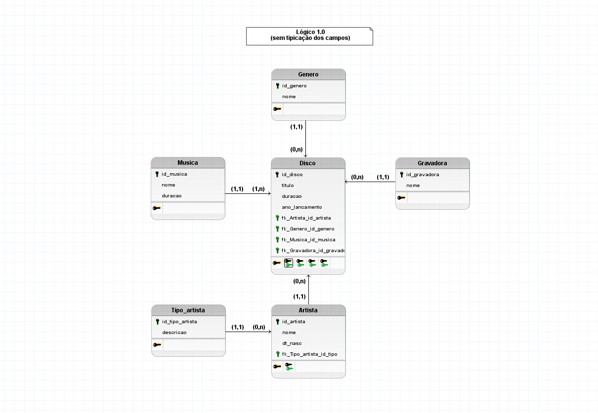
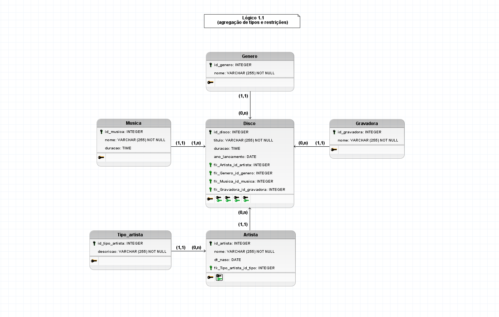

# Modelagem da Discoteca

## Regra de Negócio / Requisitos
Uma discoteca gostaria de catalogar sua coleção, e para isso contratou uma empresa pequena para criar seu sistema. Após uma longa entrevista com o analista de requisitos o mesmo chegou na seguinte regra de negocio relevante para o dono da discoteca. Todos os seus discos devem conter id, titulo, duração, ano de lançamento, o artista, e a gravadora que produziu e publicou cada disco, sendo que é relevante saber também quais são as musicas de cada disco e seu gênero musical, entenda como artista a banda, o conserto, a dupla ou o artista solo, porém para artistas solo deve-se saber além do nome a sua data de nascimento, ja para as musicas é necessário saber o nome e tempo de duração. As musicas somente podem estar em um único disco e nenhum disco deve ser cadastrado sem suas musicas, gravadoras podem ser cadastradas mesmo que não possuam discos associados a ela. Deve ser possível registrar artistas sem disco e o disco deve conter apenas um artista associado a ele.

---

## Modelo conceitual (DER 1.0)

### Conceitual

#### 1.0 - Relações com seus atributos, sem cardinalidades estabelecidas

#### 1.1 - Relações com seus atributos, com cardinalidades estabelecidas

#### 1.2 - Relações com seus atributos, com cardinalidades estabelecidas e desmembramentos com relações de n:n

Este projeto não possui relacionamentos **muitos-para-muitos** (N:M), portanto, esse tipo de diagrama não foi contemplado na modelagem.

---

### Lógico

#### 1.0 Sem tipicação dos campos

#### 1.1 Agregação de tipos e restrições

---

### Fisíco

Os script sql responsavel pela geração do banco de dados propostos, abaixo:

|1. CREATE |  2. INSERT |
|-------------------------------|-------------------------------------------------|
[CREATE SQL](../../scripts_sql/create/1_discoteca_scripts_create.sql) | [INSERT SQL](../../scripts_sql/insert/2_discoteca_scripts_insert.sql) |

---

### Carga de dados

___Os dados inseridos neste projeto foram dados reais de input manual diretamente no script. Totalizando uma carga de 500 linhas geral para o que foi solicitado.___

Gere um script separado para a carga de dados para o teste de extres do banco de dados, devemos ter:

- 5 gravadoras distintas
- 10 discos para cada gravadora
- minimo de 7 e maximo de 10 musicas por disco. (não podendo conter apenas a masma quantidade)
- devemos ter pelo menos 30 artistas diferentes
- os artivas devem ser dos mais variados possiveis (banda, o conserto, a dupla ou o artista solo,)

---

### Entrega

Você deve colocar toda a sua documentaçẽo em um repositorio do github e entregar na plataforma apenas o link para o mesmo. Seu documento deve conter meios de contato, resumo do projeto e logo das tecnologias usadas, assim como logo do senai em referencia a instituição.

---

Página Inicial |
|-------------------------------|
[Início](../../README.md) |